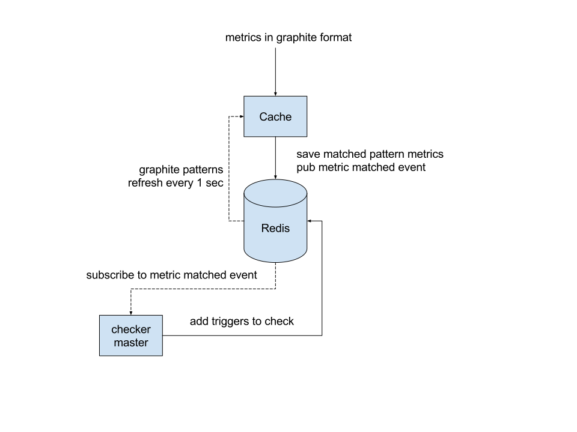
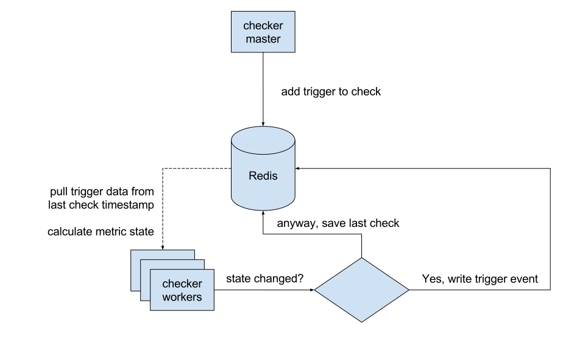
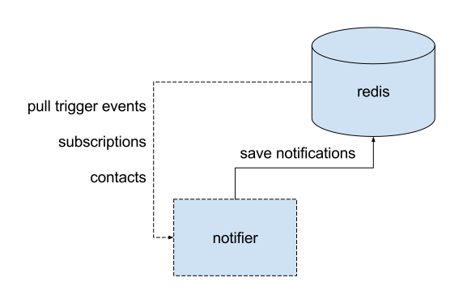

Architecture
============

.. _target: http://graphite.readthedocs.org/en/1.0/url-api.html#target

.. raw:: html

    

Terminology
-----------

Pattern
^^^^^^^

A Graphite pattern is a single dot-separated metric name, possibly containing one or more wildcards.

Examples:

.. code-block:: text

   server.web*.load
   server.web{1,2,3}.load
   server.web1.load

Target
^^^^^^

A Graphite target_ is one or more patterns, possibly combined using Graphite functions.

Examples:

.. code-block:: text

   averageSeries(server.web*.load)

Metric
^^^^^^

A metric is a single time-series that is a result of parsing some Graphite target.

Some targets produce a single metric, for example:

.. code-block:: text

   server.web1.load
   highestCurrent(server.web*.load)

Some targets produce several metrics, for example:

.. code-block:: text

   movingAverage(server.web*.load, 10)

State
^^^^^

Moira stores separate state for every metric. Each metric can be in only one state at any moment:

.. raw:: html

   OK

   WARN

   ERROR

   NODATA

Trigger
^^^^^^^

Trigger is a configuration that tells Moira which metrics to watch for. Triggers consist of:

- Name. This is just for convenience, user can enter anything here.
- One or more targets.
- WARN and ERROR value limits, or a Python expression to calculate state.
- One or more tags.
- TTL value. Metrics switch to NODATA state when new data doesn't arrive for TTL seconds.
- Check schedule. For example, a trigger can be set to check only during business hours.

Last Check
^^^^^^^^^^

When Moira checks a trigger, it stores the following information on each metric:

- Current value.
- Current timestamp.
- Current state.

Trigger Event
^^^^^^^^^^^^^

When Moira checks a trigger, if any of the metric states change, Moira generates an event. Events consist of:

- Trigger ID.
- Metric name (as given by parsed target).
- New state.
- Previous state.
- Current timestamp.

Tags
^^^^

Tags are simple string markers for grouping of triggers and configuring subscriptions.

Subscription
^^^^^^^^^^^^

Moira generates notifications for an event only if trigger tags match any of the user-created subscriptions.
Each subscription consists of:

- One or more tags.
- Contact information.
- Quiet time schedule.

Dataflow
--------

Save and Filter Incoming Metrics
^^^^^^^^^^^^^^^^^^^^^^^^^^^^^^^^

When user adds a new trigger, Moira parses patterns from targets and saves them to ``moira-pattern-list`` key in Redis. Cache rereads this list every second.
When a metric value arrives, Cache checks metric name against the list of patterns. Matching metrics are saved to ``moira-metric:<metricname>`` keys in Redis.
Redis pub/sub mechanism is used to inform Checker-master of incoming metric value that should be checked as soon as possible.

Checker-master reads triggers by pattern from ``moira-pattern-triggers:<pattern>`` key in Redis and adds triggers to check set at ``moira-triggers-tocheck`` Redis key.
In case of no incoming data, all triggers are added to check once per ``nodata_check_interval`` setting.

Check Triggers
^^^^^^^^^^^^^^

Checker-worker constantly reads ``moira-triggers-tocheck`` key in Redis and calculates trigger targets values. Target can contain one or multiple metrics, so results are written per metric.

``moira-metric-last-check:<trigger_id>`` Redis key contains last check JSON with metric states.

When a metric changes its state, a new event is written to ``moira-trigger-events`` Redis key. This happens only if value timestamp falls inside time period allowed by trigger schedule.

Process Trigger Events
^^^^^^^^^^^^^^^^^^^^^^

Notifier constantly pulls new events from ``moira-trigger-events`` Redis key and schedules notifications according to subscription schedule and throttling rules.
If and only if a trigger contains *all* of the tags in a subscription, a notification is created for this subscription.

Subscription schedule delays notifications of occurred event to the beginning of next allowed time interval.
Note that this is different from trigger schedule, which suppresses event generation entirely.

Throttling rules will delay notifications:

- If there are more than 10 events per hour, a notification will be sent at most once per 30 minutes.
- If there are more than 20 events per 3 hours, a notification will be sent at most once per hour.

Scheduled notifications are written to ``moira-notifier-notifications`` Redis key.

Process Notifications
^^^^^^^^^^^^^^^^^^^^^

.. image:: ../_static/dfd-notifier-notifications.svg
   :alt: checker
   :scale: 100%

Notifier constantly pulls scheduled notifications from ``moira-notifier-notifications`` Redis key.
It calls sender for certain contact type and writes notification back to Redis in case of sender error.
