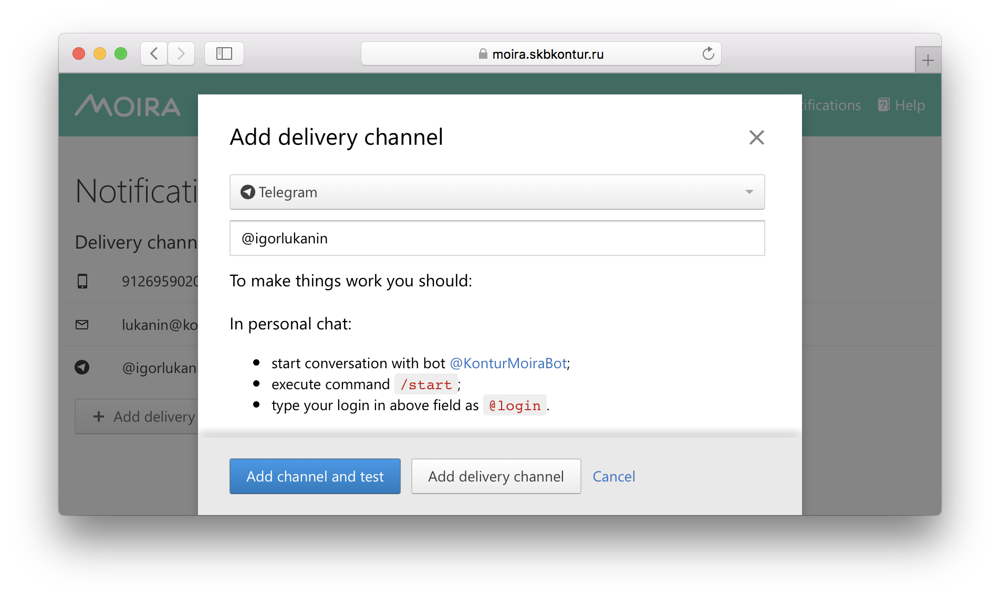

Google Summer of Code
=====================

Here is the ideas page for Google Summer of Code 2020.

We encourage interested students to contact mentors to discuss these ideas or propose
new ones. The Moira team would appreciate your contributions.

About Moira
-----------

Moira is a realtime alerting system based on Graphite data.

It's key features are:

* storage independence
* simple and advanced trigger syntax
* tags for triggers and subscriptions
* extendable notification channels
* alarm fatigue protection

See `overview <./overview.html>`_ for more.

.. image:: ./_static/gsoc-moira-screencast.gif

Moira is written in Go, the web UI is written in JavaScript.

The source code is licensed under MIT.

Mentors
-------

* Alexey Kirpichnikov (`beevee <https://github.com/beevee>`_)
* Arkady Borovsky (`borovskyav <https://github.com/borovskyav>`_)
* Emil Sharifullin (`litleleprikon <https://github.com/litleleprikon>`_)
* Andrey Kolkov  (`androndo <https://github.com/androndo>`_)
* Sorokin Vladimir (`sorovlad <https://github.com/sorovlad>`_)

Ideas
-----

Health checks for delivery channels and contacts
^^^^^^^^^^^^^^^^^^^^^^^^^^^^^^^^^^^^^^^^^^^^^^^^

**Explanation.**
Moira's users are able to set up new delivery channels and contacts to be used with those channels.
However Moira doesn't check if the channel configuration is valid and alerts can be actually sent.
A user may provide a non-existent Slack user name, block Moira's bot in Telegram, etc. 
As a result, such user wouldn't be able to receive alerts.
The bad thing is that sometimes invalid configuration would cause Moira's bots to be banned for a certain period of time.
This effectively means a denial-of-service for alerts which is highly undesirable.

The aim of this project is to implement health checks when delivery channels and contacts are set up.
To do so, one should enhance the delivery channel and contact setup flow: send a test alert, verify that it's received, don't let to save an invalid configuration otherwise.
Certain modifications of the web UI may be required.

**Code reference.**
See `contact API <https://github.com/moira-alert/moira/blob/master/api/controller/contact.go>`_ source code and `subscription API <https://github.com/moira-alert/moira/blob/master/api/controller/subscription.go>`_ source code.

**Required skills.**
Go skills to add health checks, a bit of JavaScript and React to tune the web UI.

**Expected outcome.**
Health checks are implemented and released.

**Mentors.**
Arkady Borovsky (borovskyav@kontur.ru),
Emil Sharifullin (e.sharifullin@kontur.ru).

RESTify Moira's API
^^^^^^^^^^^^^^^^^^^^^^^^^^^^^^^^^^

**Explanation.**

Moira designed to be API-first solution and all the setup of alerting must be done via HTTP API. Unfortunately Moira'a API right now is not follow all the principles of `REST <https://restapitutorial.com>`_. This means that HTTP methods somewhere are not used correctly and URL paths somewhere are not describe the resources in a right way. Additionally some of the endpoints provide the data which schema is overcomplicated and contains wrong attributes. The great solution for this type of issues will be to use `JSON API standard <https://jsonapi.org>`_.

The aim of this project is to define methods of API that do not follow to the and change it using the REST and JSON API principles.

**Code reference.**
See `Moira's API <https://github.com/moira-alert/moira>`_ source code and the `OpenAPI description <https://app.swaggerhub.com/apis/Moira/moira-alert>`_ source code.

**Required skills.**
General Go skills. Familiarity with OpenAPI or Swagger. Knowledge of REST and JSON API principles.

**Expected outcome.**
Moira's API is RESTful.
OpenAPI description is up to date.
Moira's frontend is changed to follow the API changes(optional).

**Mentors.**
Emil Sharifullin (e.sharifullin@kontur.ru),
Andrey Kolkov  (androndo@kontur.ru).

Moira's Business Metrics
^^^^^^^^^^^^^^^^^^^^^^^^^^^^

**Explanation.**
Moira is a huge and complicated software and it operates with a huge amount of data. Sometimes for statistics and troubleshooting we need to define some metrics that will more precise tell us which amount of load Moira is carrying on. The example of this metrics is: amount of triggers with tagged metrics, amount of triggers with huge amount of metrics, amount of triggers with and without subscriptions, etc.

To achieve this goal we can create a new microservice that will collect this data from storage and export it to graphite or implement this metrics to existing services.

**Code reference.**
See `Moira's backend <https://github.com/moira-alert/moira>`_ source code.

**Required skills.**
Go skills. Familiarity with graphite would be a plus.

**Expected outcome.**
Created a new service that will export business metrics or this metrics export will be added to existing services.

**Mentors.**
Alexey Kirpichnikov (alexkir@kontur.ru),
Andrey Kolkov  (androndo@kontur.ru).

Complete Moira's mobile web version
^^^^^^^^^^^^^^^^^^^^^^^^^^^^^^^^^^^^

**Explanation.**

To provide best user experience Moira's web UI were developed with accuracy and meant to be as much minimalistic and laconic as possible. But still there are exist pages that do not look perfectly in mobile version of web interface. The example of this pages are following pages:

* Main page and navigation on it
* Subscriptions page
* Trigger page and trigger edit pages
* Teams page

The aim of this project is to add this pages to mobile version of Moira's web UI and build the UI with best user experience in mobile environment.

**Code reference.**
See `Moira's web UI <https://github.com/moira-alert/web2.0>`_ source code.

**Required skills.**
JavaScript, TypeScript and React skills. Knowledge of UX will be a plus.

**Expected outcome.**
Moira's mobile web UI allows user to use the pages that are listed above.

**Mentors.**
Sorokin Vladimir (v_sorokin@kontur.ru),
Arkady Borovsky (borovskyav@kontur.ru).

Noisy trigger analysis tools
^^^^^^^^^^^^^^^^^^^^^^^^^^^^

**Explanation.**
On-call engineers are badly affected by noisy triggers that generate alerts multiple times a day.
Attention to alerts reduces greatly, and chances to miss one important alert grow.
One badly configured flapping trigger can affect the entire workflow.
Our documentation contains an `entire page <./user_guide/efficient.html>`_ dedicated to this problem with some tips on mitigation.
But we can do more.

The aim of this project is to help Moira users identify noisy triggers.
To do so, one should research and define a metric of trigger noisiness, and then create a UI page that demonstrates worst triggers to the user.

**Code reference.**
See `Moira's backend <https://github.com/moira-alert/moira>`_ source code and `Moira's web UI <https://github.com/moira-alert/web2.0>`_ source code.

**Required skills.**
Basic Go and JavaScript skills.

**Expected outcome.**
Moira's web UI allows user to see noisy trigger list, optionally filtered by tags.

**Mentors.**
Alexey Kirpichnikov (alexkir@kontur.ru),
Emil Sharifullin (e.sharifullin@kontur.ru).

Done in previous years
----------------------

.. warning::
   Following projects are no longer available.

OpenAPI description of Moira's API
^^^^^^^^^^^^^^^^^^^^^^^^^^^^^^^^^^
Done in 2020 by `Michael Okoko <https://github.com/idoqo>`_.

**Explanation.**
Moira's web UI is nice and widely used. 
However, users don't always want to create triggers, subscriptions, and contacts manually.
They would like to be able to automate routine tasks with the tools like `Ansible <https://www.ansible.com>`_ which they already use to bootstrap database and application clusters.
For this kind of automation, Moira should have a well-documented API and a number of client libraries for all popular languages.
At this point, Moira doesn't have any API documentation.
To use the API, one should study Moira's source code or an existing client library source code to understand how the API works and reverse-engineer contracts of its methods.

The aim of this project is to provide an always up-to-date documentation of Moira's API and a few client libraries.
To do so, one should create an `OpenAPI <https://github.com/OAI/OpenAPI-Specification>`_ description of API, generate a number of client libraries for popular programming languages with `Swagger tools <https://swagger.io/tools/open-source/>`_, and setup a process so the documentation and the clients are updated when a new API version is released.

**Code reference.**
See `Moira's API <https://github.com/moira-alert/moira>`_ source code and the `Python client library <https://github.com/moira-alert/python-moira-client>`_ source code.

**Required skills.**
General Go or Python skills. Familiarity with OpenAPI or Swagger would be a plus.

**Expected outcome.**
Moira's documentation has a link to a human-readable API documentation.
Client libraries are released (not required).
There's a process in place to update the documentation and the clients on API changes.

**Mentors.**
Emil Sharifullin (e.sharifullin@kontur.ru),
Alexey Kirpichnikov (alexkir@kontur.ru).

Flow to TypeScript migration
^^^^^^^^^^^^^^^^^^^^^^^^^^^^

Done in 2020 by `Gilevich Petr <https://github.com/unvir>`_.

**Explanation.**
Nowadays, Moira's web UI is written in JavaScript and `Flow <https://flow.org>`_ is used as a type checker.
Although we love Flow dearly, TypeScript is adopted widely and has a bigger community.
This makes TypeScript a better choice for Moira's web UI development.

The aim of this project is to migrate Moira's web UI source code from Flow to TypeScript.
To do so, one should analyze the code base, propose a migration strategy, actually rewrite the code, and change the build process if needed.

**Code reference.**
See `Moira's web UI <https://github.com/moira-alert/web>`_ source code.

**Required skills.**
JavaScript and TypeScript skills. Familiarity with Flow would be a plus.

**Expected outcome.**
Moira's web UI source code is migrated to TypeScript.
A new major version of Moira's web UI is released.

**Mentors.**
Alexey Kirpichnikov (alexkir@kontur.ru),
Nikolay Kudrin (n.kudrin@kontur.ru).

Support for additional delivery channels
^^^^^^^^^^^^^^^^^^^^^^^^^^^^^^^^^^^^^^^^

Done in 2019 by `Aswin <https://github.com/aswinmprabhu>`_.

**Explanation.**
Moira supports a number of delivery channels such as email, Slack, Telegram, etc. to inform users that a certain trigger was activated (see :ref:`subscriptions`).

The aim of this project is to provide support for a number of additional delivery channels.
To do so, one should talk to community and research possible channels to be added, contribute corresponding `senders <https://github.com/moira-alert/moira/tree/master/senders>`_, and tune the web UI to allow users to create subscriptions using new channels.

.. image:: ./_static/gsoc-moira-delivery-channels.png

**Code reference.**
See `email sender <https://github.com/moira-alert/moira/blob/master/senders/mail/mail.go>`_ source code or `Pushover sender <https://github.com/moira-alert/moira/blob/master/senders/pushover/pushover.go>`_ source code.

**Required skills.**
Go skills to add senders, a bit of JavaScript and React to tune the web UI.

**Expected outcome.**
Some qualitative or quantitative data on channel popularity is collected.
Several delivery channels are added to Moira and released.

**Mentors.**
Alexey Kirpichnikov (alexkir@kontur.ru),
Alexander Sushko (sushko@kontur.ru).
