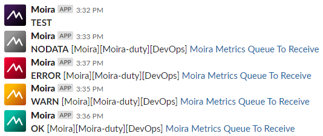
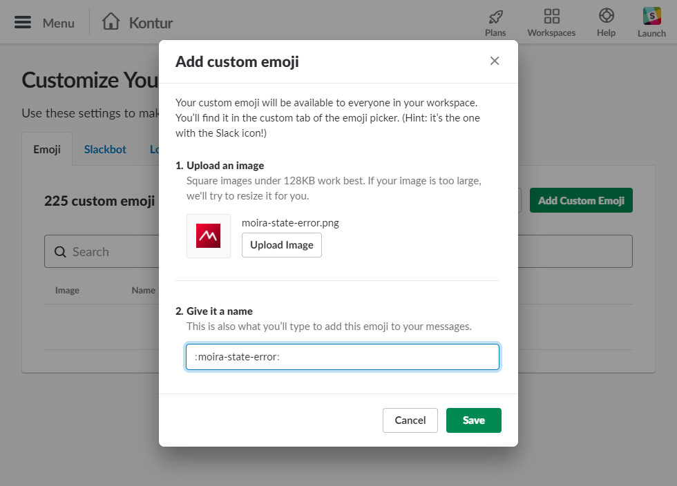
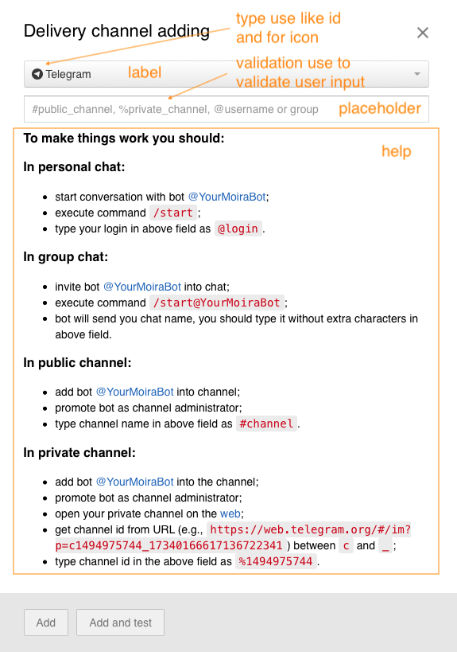

Configuration
=============

By default, microservices will look for ``/etc/moira/<servicename>.yml``, but you can change this location
by passing your path as a command-line parameter ``--config``.

On this page you can find examples of configuration files for Moira microservices.

.. _filter-configuration:

Filter
------

.. _storage-schemas.conf: http://graphite.readthedocs.io/en/latest/config-carbon.html#storage-schemas-conf

.. literalinclude:: ../../filter.example.yml
   :language: yaml

storage-schemas.conf_ is graphite carbon configuration file that should match similarly-named file in your Graphite installation.

Checker
-------

.. literalinclude:: ../../checker.example.yml
   :language: yaml

.. _remote-triggers-checker:

Remote Triggers Checker
^^^^^^^^^^^^^^^^^^^^^^^

One of Moira key feature is Graphite independance. Some Graphite queries are *very* ineffective. 
Tools like Seyren_ multiply this effect every minute making
lots of ineffective queries and overloading your cluster. Moira relies on the incoming
metric stream, and has its own fast cache for recent data.

Enabling Remote triggers Checker allows user to create triggers that relies on Graphite Storage instead of Redis DB.

.. warning:: Use this feature with caution, because it can create an extra load on Graphite HTTP API.

.. _lazy-triggers-checker:

Lazy Triggers Checker
^^^^^^^^^^^^^^^^^^^^^^

In Moira 2.4 we add a new entity - Lazy Trigger. This is a regular trigger but without any subscription for it.
By default Moira treats any trigger equally regardless on its subscriptions number.
You can change this behaviour using ``lazy_triggers_check_interval`` option in checker section. This can reduce CPU usage on your server.
Lazy triggers checker works if ``lazy_triggers_check_interval`` > ``check_interval``. We recommend set it to ``10m`` (10 minutes).

.. _notifier-configuration:

Notifier
--------

.. literalinclude:: ../../notifier.example.yml
   :language: yaml

.. _slack-icons:

Slack icons
^^^^^^^^^^^

By default slack sender won't change default icon configured for your bot.
To use state-specific icons in notifications:

- Download and unzip `notification icons <https://github.com/moira-alert/doc/blob/master/notification-icons.zip>`_.
- Add icons from '..icons/slack' directory as custom emojis according to their filenames to `slack <https://get.slack.help/hc/en-us/articles/206870177-Add-custom-emoji>`_.
- Set ``use_emoji`` to ``true`` for slack sender section in notifier config

Email template
^^^^^^^^^^^^^^

By default mail sender will use 'Fancy' template:

.. image:: ../_static/fancy-email-template.png
   :alt: Fancy email template
   :width: 400

Self state monitor
^^^^^^^^^^^^^^^^^^

If self state monitor is enabled, Moira will periodically check the Redis connection,
the number of incoming metrics in the Moira-Filter and the number of triggers to be checked by Moira-Checker.

See :doc:`../user_guide/selfstate` for more details.

API
---

.. literalinclude:: ../../api.example.yml
   :language: yaml

WEB UI
------

.. literalinclude:: ../../web.example.json
   :language: json

- `type` — contact type: pushover, slack, mail, script, telegram, twilio sms, twilio voice;
- `validation` — regular expression for user contact;
- `title` — hint shown in input field;
- `help` — help text in Markdown_ markup .
- `remoteAllowed` — set to ``true`` if `Remote Triggers Checker`_ is enabled.

.. _Markdown: https://daringfireball.net/projects/markdown/syntax
.. _Seyren: https://github.com/scobal/seyren
