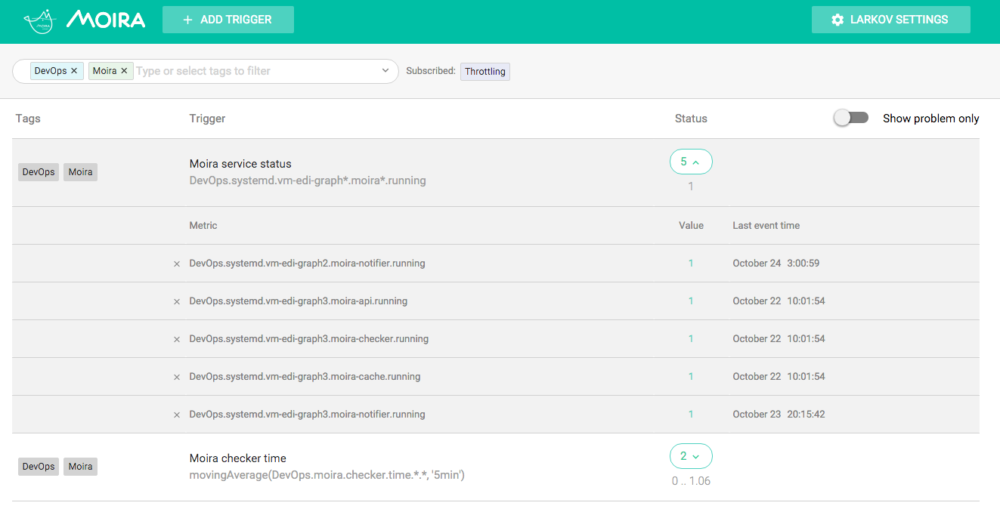

Overview
========

.. _Graphite: https://github.com/graphite-project

Moira is a real-time alerting tool, based on Graphite_ data.

Key Features
------------

.. _Seyren: https://github.com/scobal/seyren
.. _Slack: https://slack.com
.. _Pushover: https://pushover.net
.. |Alarm fatigue| replace:: **Alarm fatigue**
.. _Alarm fatigue: https://en.wikipedia.org/wiki/Alarm_fatigue
.. _carbonapi: https://github.com/go-graphite/carbonapi/blob/a5304b99d57da999a8561f6dee7745ef88164d2c/COMPATIBILITY.md#functions
.. _govaluate: https://github.com/Knetic/govaluate/blob/master/MANUAL.md

* **Graphite storage independence**

  Some Graphite queries are *very* ineffective. Tools like Seyren_ multiply this effect every minute making
  lots of ineffective queries and overloading your cluster. Moira relies on the incoming
  metric stream, and has its own fast cache for recent data.

* **Support for (almost) all Graphite functions**

  Graphite function library (carbonapi_) is embedded directly into Moira source code. You can use any
  function and get predictable results, like in your Graphite or Grafana dashboards.

* **Support for custom expressions**

  If simple warning/error threshold is not enough, you can write flexible govaluate_ expressions to
  calculate trigger state based on metric data.

* **Tags for triggers and subscriptions**

  When several teams/services share one monitoring tool, it is essential to provide some way of
  filtering triggers and subscriptions in the UI. Moira has a flexible tag system.

* **Extendable notification channels**

  Moira supports email, Slack_, Pushover_ and many other channels of notification out-of-the-box. But you can always
  write your own plugin in Go and rebuild Moira Notifier microservice.

* |Alarm fatigue|_ **protection**

  Sometimes one of your triggers goes mad and switches back and forth between states, sending you
  hundreds of notifications. Sometimes you just ignore and delete all messages, accidentally also
  deleting one that is actually important. Moira tries to protect you with a feature called
  *throttling*. It's simple: if one of your triggers starts to send over 10 messages per an
  hour, Moira limits this trigger to one message per 30 minutes. Alerts from this trigger are
  combined, and not lost - just packaged into a single message.

Limitations
-----------

By default, Moira stores metric history for one hour. This ensures performance under heavy load.
You can tweak this in config file, but note that performance will degrade.

In order to reduce database load, Moira checks every single trigger at most once every 5 seconds.
Probably, your metrics arrive once every minute, so you really won't notice this limitation.
You can also tweak this in config file.

Microservices
-------------

In spirit of Graphite architecture, Moira consists of several loosely coupled microservices. You are
welcome to replace or to add new ones.

Filter
^^^^^^

Filter is a lightweight service responsible for receiving lots of metric data in Graphite
format. It filters received data and saves only metrics that match any of user triggers. This
reduces load on all other parts of Moira.

Checker
^^^^^^^

Checker is an application with embedded Graphite functions. Checker watches for incoming
metric values and performs checks according to saved trigger settings. When state of any trigger
changes, Checker generates an event.

Notifier
^^^^^^^^

Notifier is an application that watches for generated events. Notifier is responsible for
scheduling and sending notifications, observing quiet hours, retrying failed notifications, etc.

API
^^^

API is an application that serves as a backend for UI.

Web 2.0
^^^^^^^

Web 2.0 is a frontend React application, it looks like this:

