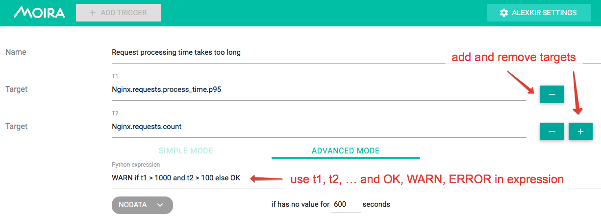

Advanced Mode Trigger
=====================

.. _govaluate: https://github.com/Knetic/govaluate/blob/master/MANUAL.md
.. _redis: https://redis.io/
.. _graphite: https://github.com/go-graphite/carbonapi
.. _prometheus: https://prometheus.io/

Sometimes a simple trigger (:doc:`/user_guide/simple`)
doesn't provide enough flexibility for your task.

For example, you may want to receive a notification when 5% of user
requests take up more than a second to process, but only if there are
more than 100 requests per minute. Usually, you will have two separate
metrics for this:

1. ``Nginx.requests.process_time.p95`` - 95th percentile
   of request processing time in milliseconds
2. ``Nginx.requests.count`` - request count per minute

Maybe you can construct a monstrous Graphite expression to reflect
this combination, but Moira's Advanced Mode is better:

You can use any govaluate_ expression with predefined constants here:

- ``t1``, ``t2``, ... are values from your targets
- ``OK``, ``WARN``, ``ERROR``, ``NODATA`` are states that must be
  the result of evaluation
- ``PREV_STATE`` is equal to previously set state, and allows you
  to prevent frequent state changes

Any incorrect expressions or bad syntax will result in EXCEPTION trigger state.

Alone Metric
-------------

By default, each target returns an array of series of values, which is then involved in the calculation of various expressions and all that would be fine, 
but problems can arise when calculating arithmetic expressions if the arrays have different sizes.

To solve this problem, a ``single`` checkbox appears in the Moira web interface **after adding new targets**, which means 
that the target returns a single series of values that can be easily used when calculating any expressions.

Example 1. (without using single)
~~~~~~~~~~~~~~~~~

1. I have metrics:

- ``host1.loadavg`` — Load Average on server host1
- ``host2.loadavg``
- ``host3.loadavg``
- ``host1.cpu_count`` — number of cores on host1
- ``host2.cpu_count``
- ``host3.cpu_count``

2. I'm creating an Advanced Mode trigger:

- t1 — ``aliasByNode(*.loadavg, 0)``
- t2 — ``aliasByNode(*.cpu_count, 0)``

Expression — ``t1/t2 > 1 ? ERROR : OK``

3. This results in three metrics in the trigger, for which the state is tracked separately:

- ``host1`` — expression is calculated for ``t1 = host1.loadavg, t2 = host1.cpu_count`` 
- ``host2`` — expression is calculated for ``t1 = host2.loadavg, t2 = host2.cpu_count``  
- ``host3`` — expression is calculated for ``t1 = host3.loadavg, t2 = host3.cpu_count`` 

Example 2. (using single)
~~~~~~~~~~~~~~~~~

1. I have metrics:

- ``host1.loadavg`` — Load Average on server host1
- ``host2.loadavg``  
- ``host3.loadavg`` 
- ``all_hosts.cpu_count`` — number of cores on any of the servers (the same everywhere)

2. I'm creating an Advanced Mode trigger:

- t1 — ``aliasByNode(*.loadavg, 0)`` 
- t2 — ``all_hosts.cpu_count`` — **alone metric**

Expression — ``t1/t2 > 1 ? ERROR : OK``

3. This results in three metrics in the trigger, for which the state is tracked separately:

- ``host1`` — expression is calculated for ``t1 = host1.loadavg, t2 = all_hosts.cpu_count`` 
- ``host2`` — expression is calculated for ``t1 = host2.loadavg, t2 = all_hosts.cpu_count`` 
- ``host3`` — expression is calculated for ``t1 = host3.loadavg, t2 = all_hosts.cpu_count``  

Templates
-------------

The template is supported by Moira, the template implements data-driven templates for generating textual output.
Information about how to program the templates themselves, see the `documentation. <https://golang.org/pkg/html/template/>`_
You can also use functions from `sprig-library. <https://pkg.go.dev/github.com/masterminds/sprig#section-readme>`_

Data you can use:
~~~~~~~~~~~~~~~~~

.. code-block:: text

  Trigger { Name }
  Events  [ ] {
   Metric
   MetricElements [ ]string
   Timestamp
   Value
   State
  }

Example:
``https://grafana.yourhost.com/some-dashboard{{ range $i, $v := .Events }}{{ if ne $i 0 }}&{{ else }}?
{{ end }}var-host={{ $v.Metric }}{{ end }}``

Strings manipulations
~~~~~~~~~~~~~~~~~~~~~
- ``{{ stringsReplace .Trigger.Name "." "_" -1 }}``
- ``{{ stringsToLower .Trigger.Name }}``
- ``{{ stringsToUpper .Trigger.Name }}``
- ``{{ stringsTrimPrefix .Trigger.Name "remove_me" }}``
- ``{{ stringsTrimSuffix .Trigger.Name "remove_me" }}``
- ``{{ stringsSplit .Trigger.Name "sep" }}``
  

See more about functions and args in golang `strings <https://golang.org/pkg/strings>`.

Date manipulations
~~~~~~~~~~~~~~~~~~
- ``{{ date $v.Timestamp }}`` print date timestamp.
- ``{{ formatDate $v.Timestamp "Mon Jan _2 15:04:05 2006" }}`` format timestamp by pattern, see `more <https://golang.org/pkg/time/#Time.Format>`_.

Also you can use some methods for events:

.. code-block:: text

  {{ range $event:= .Events }}
  {{ $event.TimestampDecrease 5 }}
  {{ end }}

- ``{{ $event.TimestampDecrease 5 }}`` - decrease event timestamp.
- ``{{ $event.TimestampIncrease 5 }}`` - increase event timestamp.

Data source
------------

If :ref:`graphite-remote-triggers-checker` or :ref:`prometheus-remote-triggers-checker` is enabled, you can
choose between following Data Sources:

- Local_ — Moira database. By default Redis stores data for only several hours.
  It covers most of user cases when you need real-time alerting.
- Graphite_ — remote Graphite-like HTTP API. It should be used only when you
  need to get metrics for a large period.
  (Only if :ref:`graphite-remote-triggers-checker` is enabled)
  .. warning:: Please, use this Data Source with caution. It may cause extra load on Graphite HTTP API.

  .. important::

    Please, keep in mind that functions in Remote and Local triggers can work differently.
    To avoid this, make sure you use Carbonapi with the same revision as in Moira. Latest Carbonapi listed in :doc:`../changelog`.
- Prometheus_ — remote Prometheus HTTP API. It could be used to select Prometheus
  metrics via PromQL. (Only if :ref:`prometheus-remote-triggers-checker` is enabled)
