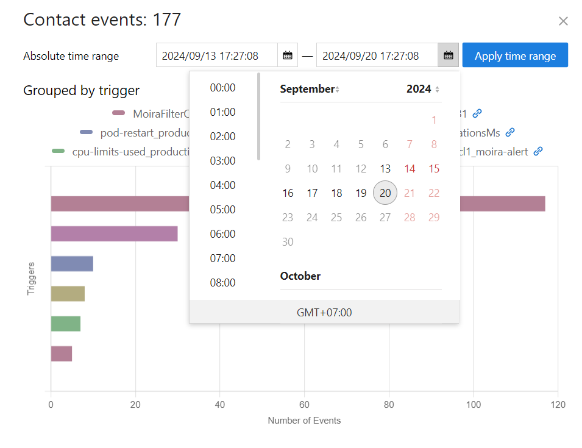

Contact notification events
==================

To track notifications in a specific delivery channel, you can use the "Events" button on the /settings page.

On the side page you may see statistics per trigger in particular time range.

And events groupped by trigger transitions.

Storage time interval may be configured, see Configuration page for details.

