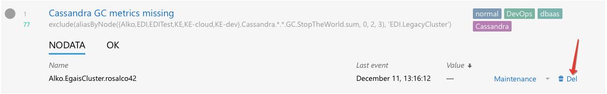

Efficient Triggers
==================

To use Moira efficiently, you should understand its underlying design decisions.

We often notice that when new users create their first triggers, they set thresholds at random, or by intuition. This is
because when you configure your first 24/7/365 automated monitoring system, you don't really know how your system works.
If you have at least hundreds of metrics, it's impossible to watch all of them with your eyes. What are the limits of
your system? How often does your system reach critical resource consumption during a day? Should you immediately react
when metric X reaches value N, or is it a fluctuation that passes by itself?

With time, when you learn to understand you system, you will need to tune your triggers. And that's when you need to
understand Moira.

States
------

Unlike many other tools, that provide several distinct level systems like "priority" and "severity", Moira supports a
single set of states. Every state has a well-defined meaning, and you should use these states accordingly.

OK
^^

This is a basic state, in which all your metrics must spend most of their time. Just like you keep your autotests green,
you should keep your metrics green.

WARN
^^^^

This state means that you should do something to prevent having ERRORs in the future. Not immediately: maybe you should
order more hardware from your vendor, or plan to optimize code in the next iteration. You can configure less intrusive
notification channels here, like email.

Metrics can be in this state for days or even weeks.

ERROR
^^^^^

This is a critical condition that requires immediate intervention. Your datacenter is on fire. All application processes
have shut down. There is no disk space left on your database server to process million-dollar transactions. These
notifications are important enough to wake you up at night. You can still configure schedules to assign shifts to several
engineers, though (see :doc:`/user_guide/schedule`). You should configure more intrusive notification channels here, like
Pushover.

Metrics should not be in this state for more than several hours.

Moira will send you reminders every 24 hours if some of your metrics remain in this state.

If a notification channel supports high-priority messages (like Pushover does), Moira will try to use them for ERRORs.

NODATA
^^^^^^

This state means that Moira hasn't been receiving data points for a metric for some time. See :doc:`/user_guide/nodata`
for details. This state is considered as bad as an ERROR in Moira (because it can actually be an ERROR - we don't receive
any data, so we don't know for sure). It may be even worse than an ERROR, because users tend to ignore metrics in this
state and leave them hanging in the web interface, greatly increasing the chance to miss something actually important.
You should delete old unused metrics from Moira when they stop providing data points:

Every metric is in this state at first. You will receive one NODATA -> OK notification when the first data point arrives.

Moira will send you reminders every 24 hours if some of your metrics remain in this state.

Moira will set NODATA state only for known metrics - i.e. for metrics that have sent at least one data point to Moira.

EXCEPTION
^^^^^^^^^

This is an error inside Moira. Unless you have bad syntax in your :doc:`/user_guide/advanced` trigger, this has nothing
to do with your metric state. You should try to fix or reinstall Moira, or contact Moira developers (see :doc:`/contacts`).

Dealing With False Positives
----------------------------

Sometimes it's hard to maintain strict rule of keeping your metrics green, if your triggers switch OK->ERROR->OK->ERROR
for short amounts of time several times a day. It can lead to alarm fatigue and missing actual failures.

There is no single recipe for eliminating false positives, but here are some tips.

Use Graphite Functions
^^^^^^^^^^^^^^^^^^^^^^

.. _functions: http://graphite.readthedocs.org/en/latest/functions.html

Graphite provides tons of useful functions_ to process data, and Moira understands all of them. For example:

- If you are experiencing peaks on you graphs that lead to unnecessary state switches, you can alleviate these peaks
  with ``movingAverage`` or ``movingMedian``.

  .. image:: ../_static/moving_average.png
     :alt: moving average Graphite function

- If you are interested in aggregate 10-minute values, not single minute values, use ``summarize``.
- If you want zeroes instead of missing data points, use ``transformNull``.
