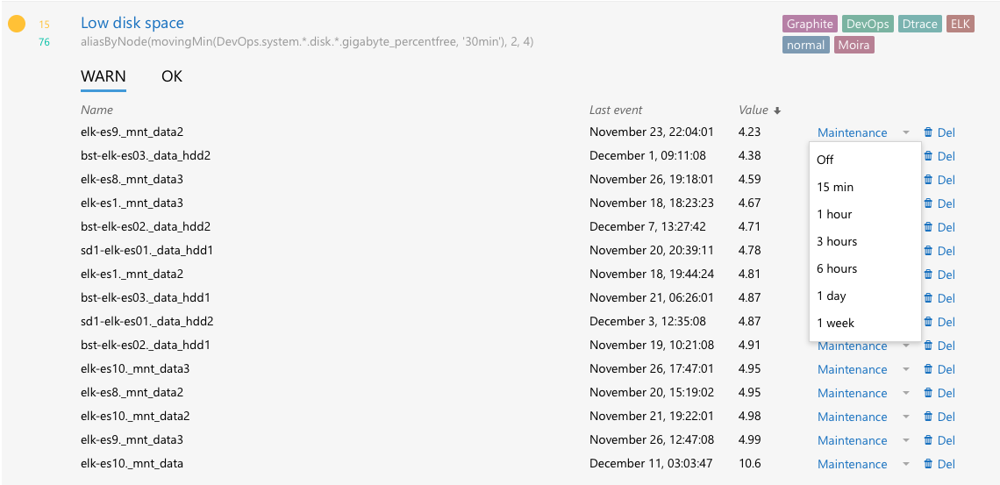

Maintenance
===========

Maintenance is a proper way to mute alerting on specific metrics. It can be useful during during planned work.

Examples
-------------------------------------

Example 1. Alert will not be sent
~~~~~~~~~~~~~~~~~~~~~~~~~~~~~~~~~

* metric ``awesomeMetric1`` is in ``OK`` state;
* Rick_ switches metric into maintenance for 1 hour;
* within an hour metric changes its state several times:

  - ``OK`` → ``WARN``,
  - ``WARN`` → ``ERROR``,
  - ``ERROR`` → ``OK``;

* after 1 hour maintenance ends, metric is in ``OK`` state;
* Moira checks if metric state changed during maintenance:

  - ``awesomeMetric1`` state before maintenance: ``OK``;
  - ``awesomeMetric1`` state after maintenance ``OK``;
* nothing to notify about: state didn't change during maintenance period.

Example 2. Alert will be sent
~~~~~~~~~~~~~~~~~~~~~~~~~~~~~~~~~

* metric ``awesomeMetric2`` is in ``OK`` state;
* Rick_ switches metric into maintenance for 1 hour;
* within an hour metric changes its state several times:

  - ``OK`` → ``WARN``,
  - ``WARN`` → ``ERROR``,
  - ``ERROR`` → ``OK``,
  - ``OK`` → ``ERROR``;

* after 1 hour maintenance ends, metric is in ``ERROR`` state;
* Moira checks if metric state changed during maintenance:

  - ``awesomeMetric2`` state before maintenance: ``OK``;
  - ``awesomeMetric2`` state after maintenance ``ERROR``;

* Moira sends message to user: metric state changed during maintenance period.

.. _Rick: https://www.youtube.com/watch?v=dQw4w9WgXcQ
