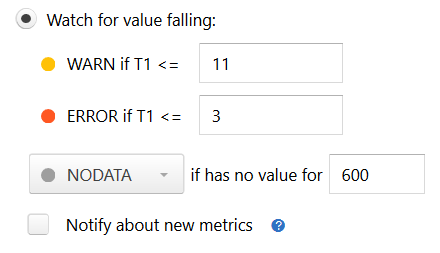

Dealing with NODATA
===================

If you have a simple trigger (like the one described in :doc:`/user_guide/simple`), you probably know what happens when
a metric has a very high or a very low value. Free disk space is too low? You get a notification.

But what if your metric has *no* value? Literally, what if Moira is not receiving any data for your metric? How can you
know, whether you have enough disk space left or not? In this case, a trigger setting defines the behavior:

When Moira hasn't been receiving data for more than default 600 seconds, it will set a special NODATA state for this metric.
You can set any other state or change time delay here. For example, if you have an error metric, and no data means no
errors, you should set this to OK.

.. note::

  Checkbox ``Notify about new metrics`` defines whether Moira should notify you about new metrics. 
  If you check this box, Moira will send you ``NODATA`` → ``OK`` event for every new metric in the trigger.
  
  New metrics alerting is useful, for example when you want to receive messages about new server added in cluster.

You can also select DEL here to automatically delete all metrics that no longer provide data. A simple use case is when
you often rename metrics and Moira quickly becomes flooded with old irrelevant metric names.

.. warning:: DEL is a dangerous setting, you can easily miss a real notification if your system stops sending metric data.

You will receive notifications when your metric goes in and out of NODATA state, just like any other state.
