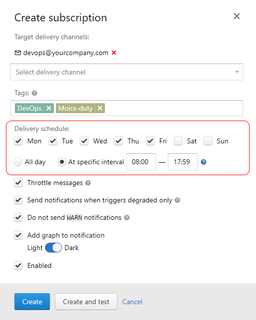
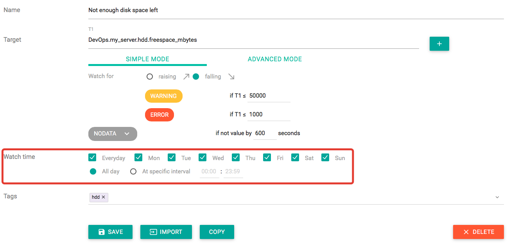

Schedules
=========

Moira provides two ways of defining allowed time intervals for notifications.

Subscription Schedule
^^^^^^^^^^^^^^^^^^^^^

If a metric is not that important to wake you up in the middle of the night, you can set a schedule for subscription:

Notifications generated by this subscription will arrive only on weekdays, from 08:00 to 17:59 local time.

If an event happens on weekend, you will receive a notification at 08:00 on Monday. So notifications are not skipped,
you just receive them later. Events will still appear on the event history page at the time when they happened (see
:doc:`/user_guide/trigger_page`).

Trigger Watch Time
^^^^^^^^^^^^^^^^^^

Sometimes you want to monitor a metric only part of the time. Let's say, you have a popular website, that serves over
1000 page views per second during the day. You can set up a trigger to notify you when you have less than 50 page views
per second - obviously, something is wrong. You also need to disable this trigger for the night, because in the night all
of your users are sleeping, and this metric is irrelevant.

Of course, you can set up a subscription schedule - but your history will become riddled with false night "events", and
you will still receive notifications in the morning. In this case, you need to set up a trigger watch time:

No events will be recorded for this trigger outside of watch time - you will receive no notifications, and the event
history page will be empty (see :doc:`/user_guide/trigger_page`).
