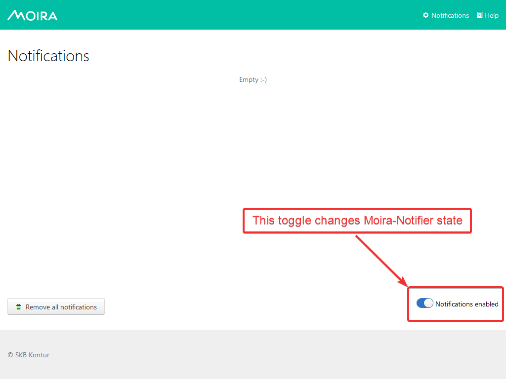

Self State Monitor
==================

Self State Monitor is a built-in mechanism designed to protect
end user from false ``NODATA`` notifications and notify administrator
about issues in Moira and/or Graphite systems.

Why Self State Monitor
-----------------------

A situation is possible when Graphite Relay, Redis DB or Moira-Filter
service breaks down. This leads to the fact that Moira doesn't receive
any metrics from Graphite. In this case, Moira has no metrics on which
it could check state of the triggers. According to the Moira logic,
it should switch triggers to ``NODATA`` state and send alert messages to users.

To handle this situation properly, we recommend turning on the Self
State Monitor. In this case, Moira will **prevent itself from sending
alert messages to end users but notify administrators of the existing
problem**.

.. warning::

  When Self State Monitor detects a problem, it disables any notifications to end users
  and does not turn it back on when the problem is over.

  Please, read this manual before using Self State Monitor in production.

.. seealso::

  For a better understanding, look at the architecture of the :ref:`Moira microservices <microservices-architecture>`.

.. _when-monitor-helps:

When Self State Monitor Helps
-----------------------------

Self state monitor checks these situations:

1. If there is no connection between Moira and Redis for longer
   than ``redis_disconect_delay``.
2. If Moira-Filter receive no metrics for longer than
   ``last_metric_received_delay``.
3. If Moira-Checker checks no triggers for longer than ``last_check_delay``.

.. seealso::

  All the above configuration parametres can be found in the :ref:`Moira-Notifier section <notifier-configuration>`
  on configuration page.

How Self State Monitor Works
----------------------------

When you turn Self State Monitor on, it works this way:

* Self State Monitor checks :ref:`Moira state <when-monitor-helps>`
  every 10 seconds.

* Something breaks down. It can be Graphite-Relay, connection
  to Redis DB or crashed Moira-Filter docker container.

* Self State send alarm message to administrator with issue discription and switch own state to ``WARN``

  *Here is an example of message*:

    .. image:: ../_static/helth-check-email.png
     :alt: email alarm message

* Self State Monitor turns Moira-Notifier service off,
  switching it in ``ERROR`` state.

  .. note::

    When Moira-Notifier switches to ``ERROR`` state, it mutes all messages to end users and only alerts administrators about Moira health issues.
    You need to fix existing problems and then manually switch Moira-Notifier back to ``OK`` using :ref:`API <notifier-state-api>`.

  *When Moira-Notifier not in* ``OK`` *state, Moira will show you an error in Web UI*:

    .. image:: ../_static/helth-check-webui.png
      :alt: WEB UI error notification

* Self State Monitor waits for ``user_notifications_interval`` and switches own state from ``WARN`` to ``ERROR`` if problem persists.
  Then users will be notified via them system-subscriptions about rised problem.

* If Self State Monitor problem disappeares then it switches own state to ``OK`` and sends notifications by these rules.

  - Self State monitor state mutates from ``WARN`` to ``OK`` then notification about Moira normalize only sends admins.
  - Self State monitor state mutates from ``ERROR`` to ``OK`` then notification sends both admins and users via system-subscriptions.

-----

.. _notifier-state-api:

Turn Moira Notifier On and Off
------------------------------

You can reveal current Moira-Notifier state or change it
on a hidden ``/notifications`` page.

.. warning::

  Please, note this toggle changes Moira-Notifier state, not user notifications preferences.

  When you disable notifications with this toggle, Moira-Notifier stops sending messages to all users.
