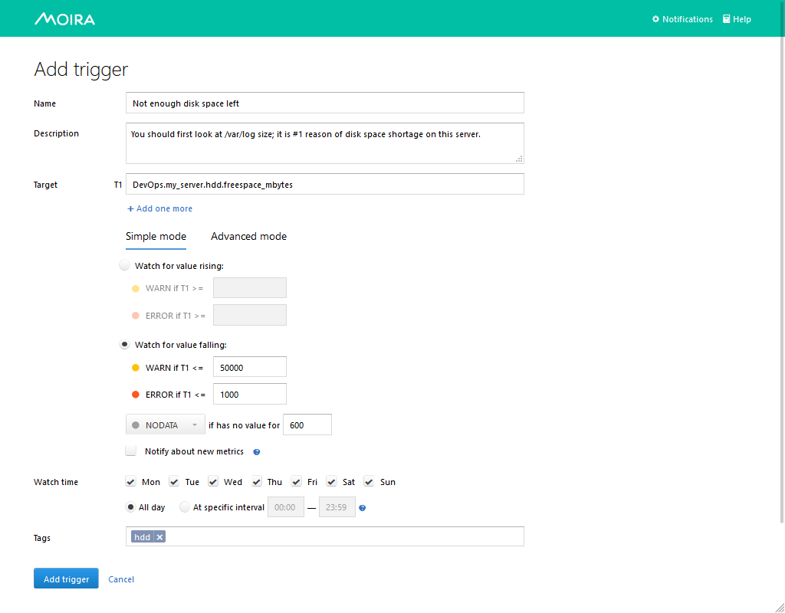
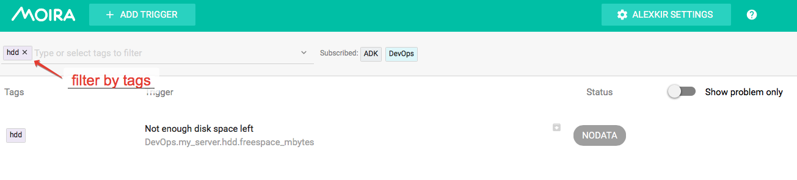

Simple Threshold Trigger
========================

.. _documentation: http://graphite.readthedocs.org/en/latest/functions.html

Let's say you measure how much free space is left on your HDD and store this value as
``DevOps.my_server.hdd.freespace_mbytes`` in Graphite. Maybe you want to get an email when you have
less than 50 GB left (it's not a big problem), and a Pushover notification when you have less than
1 GB left (you really need to delete something asap).

You can easily accomplish this by adding a trigger in Moira's Simple Mode:

Graphite Target
---------------

You can specify a single metric like we did here: ``DevOps.my_server.hdd.freespace_mbytes``.

You can also specify multiple metrics like ``DevOps.*.hdd.freespace_mbytes``. All metrics will be monitored separately,
and you will get separate notifications for each metric.

You can even use Graphite functions like ``movingAverage(DevOps.my_server.hdd.freespace_mbytes, 10)``.
Moira understands everything that Graphite itself understands. See appropriate documentation_.

Thresholds
----------

In simple mode you need to specify two threshold values: WARNING and ERROR. In our example, lower values are bad,
so we set warning threshold greater than error threshold. In this case, Moira will consider any value less than 50000
a warning and less than 1000 an error, which is what we want. In other cases, you may need to consider
large values a problem - then you should make error threshold greater than warning and select ``Watch for value rising`` option.

Tags
----

In Moira, you cannot subscribe to a single trigger. Instead, you should categorize your triggers by
tags and subscribe to a tag. It may look like an overkill here, but when you have dozens of triggers,
you are much better off with tags, because you don't have to enter your contact information over and over again.
Tags also help to filter information on main screen:

You can add as many tags as you want.

Subscriptions
-------------

Proceed to the :doc:`/user_guide/subscriptions` page to learn how to set up a subscription to your trigger.
