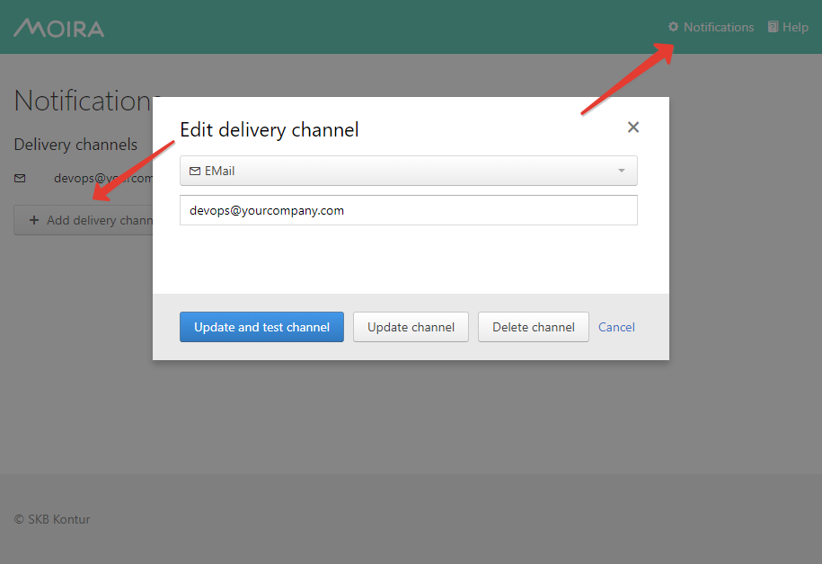

.. include:: <isonum.txt>

.. _subscriptions:

Setting Up Your Subscriptions
=============================

By now you should have at least one trigger saved. If you don't,
go back to the :doc:`/user_guide/simple` page.

First, add some delivery channels:

If your Moira installation is configured with separate user accounts,
you will see only your channels and subscriptions on this page. Otherwise,
every user will see the same page with the same channels and subscriptions.

Consult :doc:`/installation/security` page for instructions on separating
user accounts.

Once you have at least one channel, you can create a subscription.
Press ``+ Add subscription`` button:

.. image:: ../_static/subscription_plotting.png
   :alt: subscription plotting settings

.. _subscriptions-plotting:

Plotting
--------

According to two existing polling approaches:

- Local triggers are best to analyze realtime metrics
- Remote triggers allows to use wider time windows to fetch
  historical data directly from Graphite

there is also two different time ranges will be used according to trigger type:

- Notification based on events generated by local trigger will contain
  graph with timeseries for the last 30 minuntes wheter is throttled
  or it was scheduled earlier because of subscription's own time limits.
- Notification based on events generated by remote trigger will contain
  graph with timeseries for not less than 30 minuntes until last event occured.
  Otherwise first and last events times will form the window.

.. image:: ../_static/subscription_tags.png
   :alt: subscription tags

Tags
----

Add required tags into subscription to receive notifications
from triggers with these tags.

Matching rule is: Notification will be sent if trigger
contains **ALL** of selected tags.

For example:

- If subscription has only one tag, you will receive notifications
  from any trigger with this tag.

  - Create Triggger1 with tags: ``["DevOps", "Moira-duty"]``
  - Create Triggger2 with tags: ``["DevOps"]``
  - Create Subscription1 with tags: ``["DevOps"]``

    By using Subscription1 you will receive events for
    both Triggger1 and Triggger2

- If subscription has multiple tags, you will receive notifications
  only from triggers which include all these tags.

  - Create Subscription2 with tags: ``["DevOps", "Moira-duty"]``

    By using Subscription2 you will receive events only for Trigger1

.. _system-tags-description:

System-tags
-----------

You can create a subscription with special tags provided by Moira Self State Monitor.
System tags may be defined in Moira's config only and cannot be mutated by any users or admins in Moira's UI.

Users can only subscribe on system tags to receive notifications from Moira Self State Monitor (read about it :doc:`/user_guide/selfstate`).

.. _system-subscriptions-description:

System-subscriptions
--------------------

If Self State Monitor detects an error then it sends notification to admins. But if end users want to get notifications about Moira's problems, they can subscribe on Self State Monitor events.
These subscriptions are called as system-subscriptions. System-subscriptions are sub-kind of Moira's subscriptions that should have only system-tags in tags list.

System-subscriptions cannot be matched to any triggers because it used by Moira Self State Monitor.

.. _subscription-states-transitions:

Ignore Specific States Transitions
----------------------------------

You also can reduce number of notifications ignoring unnecessary event.
For this purpose use following check boxes:

- Send notifications when triggers degraded only

  Only following states transitions will require notifications:

  - ``OK`` |rarr| ``WARN``
  - ``OK`` |rarr| ``ERROR``
  - ``OK`` |rarr| ``NODATA``
  - ``WARN`` |rarr| ``ERROR``
  - ``WARN`` |rarr| ``NODATA``
  - ``ERROR`` |rarr| ``NODATA``

- Do not send WARN notifications

  Following states transitions will be ignored:

  - ``OK`` |rarr| ``WARN``
  - ``WARN`` |rarr| ``OK``

Create and Test
---------------

You can just save your subscription, but if you want to be 100% sure
it works, you should immediately test it. Dummy notification message
will arrive shortly.
