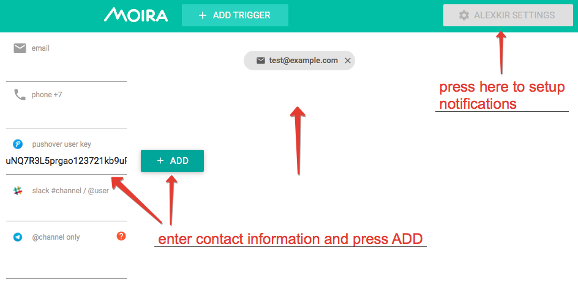
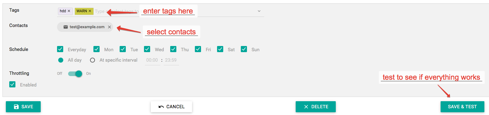

Setting Up Your Subscriptions
=============================

By now you should have at least one trigger saved. If you don't, go back to the :doc:`/user_guide/simple` page.

First, add some contacts:

If your Moira installation is configured with separate user accounts, you will see only your contacts
and subscriptions on this page. Otherwise, every user will see the same "Anonymous settings" page with
the same contacts and subscriptions.

Consult :doc:`/installation/security` page for instructions on separating user accounts.

Once you have at least one contact, you can create a subscription. Press +NOTIFICATION button:

Tags
----

You will receive notifications from triggers with these tags. Note that a trigger must contain *all*
of the subscription tags to match. For example, if you create a subscription for ``tag1``, ``tag2``,
you will receive notifications from trigger with ``tag1``, ``tag2``, ``tag3``, but not from trigger
with ``tag1`` only.

``WARN`` and ``ERROR`` are special pseudo-tags that match only events with corresponding level. For example,
you may wish to subscribe your Pushover account only to ERROR-level notifications.

Contacts
--------

Select contacts for your notification by clicking on them. You can add as many contacts to one notification
as you want.

Save & Test
-----------

You can just save your notification, but if you want to be 100% sure it works, you should immediately test it.
Dummy notification message will arrive shortly.
