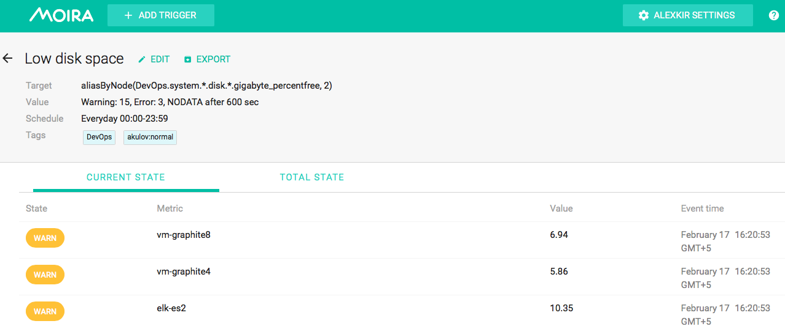
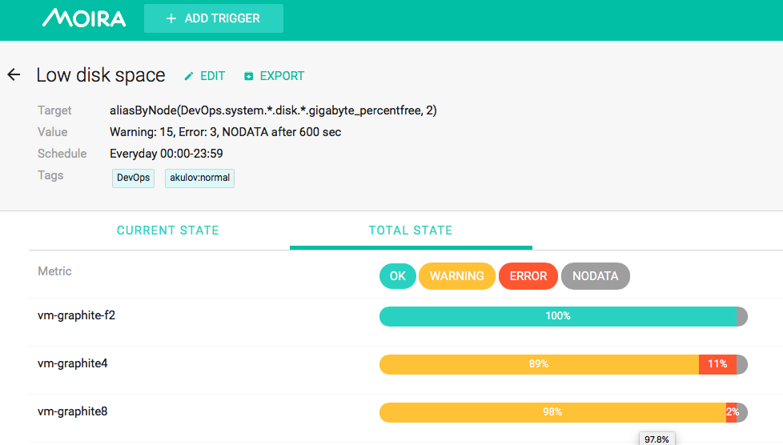
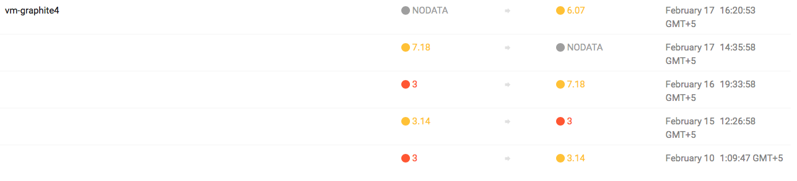

Current State, Total State and Event History
============================================

By clicking on a saved trigger, you can see current state, total state and event history of this trigger.

Current State
-------------

Moira shows current state, current value and time of last event for every separate metric that matches the trigger.

Total State
-----------

On this tab you can see total statistics for each separate metric.

Event History
-------------

Under the current state information you can see a chronologically sorted list of events for each separate metric.
Each event includes time, old and new values. Please, note that the left (old) value is taken from the previous event,
and does not represent metric value just before the event.

